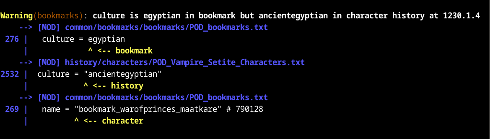
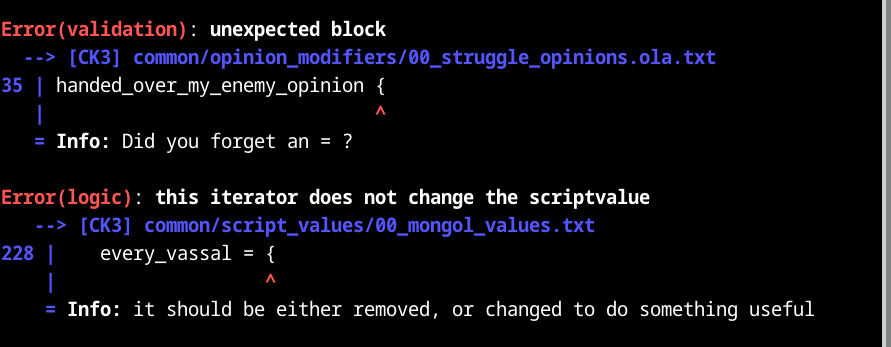

# 

Tiger pounces on bugs. Checks Crusader Kings 3, Victoria 3, or Imperator: Rome user mod files for mistakes and warns about them. For example: missing localizations, or using a faith trigger on a character.

These games are grand strategy games made by Paradox Interactive, and user mods are made by the players to enhance or change their game experience. This tool is for the people who make the mods.

## Status

Tiger is mature but will still warn about some things that are actually correct. It will also often take a few days or even weeks to catch up with the latest updates to the games it supports.

Support for Hearts of Iron IV (`hoi4-tiger`) is in the works but it is **unfinished** and in its current state will produce thousands of false positives.

## Features

`ck3-tiger` (or `vic3-tiger` or `imperator-tiger`) will read the relevant vanilla files and your mod's files, and it will complain about everything in your mod that looks wrong. Where possible, it will tell you why it thinks the thing is wrong.

* Syntax validation: are you using the right key = value pairs? No misspellings?
* Missing items: is every game object that you refer to actually defined somewhere?
* Missing localizations: do you have all the localizations you need for your mod?
* Scope consistency checking: are you using culture effects on cultures and character effects on characters, etc.?
* History (for CK3): Are spouses, employers, and lieges alive on the relevant dates? Is no one their own grandfather?
* Special: rivers.png check

Tiger can also be configured to validate submods, by loading the parent mods first.

## Sample output

## How to use

### `ck3-tiger`

Download a release package from [GitHub](https://github.com/amtep/tiger/releases). Unpack it somewhere.

On Windows, if everything works out, you can then just double-click on `ck3-tiger-auto` and it will try its best.

Otherwise, run the tool from the command prompt:
<pre>
<i>path/to/</i>ck3-tiger <i>path/to/your/</i>descriptor.mod
</pre>
or
<pre>
<i>path/to/</i>ck3-tiger "<i>path/to/</i>Paradox Interactive/Crusader Kings III/mod/YourMod.mod"
</pre>

(Note that the quote marks around the path are important because of the spaces in it.)

If you want the output in a file, you can redirect it like this:
<pre>
ck3-tiger <i>path/to/your/</i>descriptor.mod ><i>filename</i>
</pre>

### `vic3-tiger`

Download a release package from [GitHub](https://github.com/amtep/tiger/releases). Unpack it somewhere.

On Windows, if everything works out, you can then just double-click on `vic3-tiger-auto` and it will try its best.

Otherwise, run the tool from the command prompt:
<pre>
<i>path/to/</i>vic3-tiger <i>path/to/your/mod</i>
</pre>
or
<pre>
<i>path/to/</i>vic3-tiger "<i>path/to/</i>Paradox Interactive/Victoria 3/mod/YourMod/"
</pre>

(Note that the quote marks around the path are important because of the spaces in it.)

If you want the output in a file, you can redirect it like this:
<pre>
vic3-tiger <i>path/to/your/mod</i> ><i>filename</i>
</pre>

### `imperator-tiger`

Download a release package from [GitHub](https://github.com/amtep/tiger/releases). Unpack it somewhere.

Run the tool from the command prompt:
<pre>
<i>path/to/</i>imperator-tiger <i>path/to/your/</i>descriptor.mod
</pre>
or
<pre>
<i>path/to/</i>imperator-tiger "<i>path/to/</i>Paradox Interactive/ImperatorRome/mod/YourMod.mod"
</pre>

(Note that the quote marks around the path are important because of the spaces in it.)

If you want the output in a file, you can redirect it like this:
<pre>
imperator-tiger <i>path/to/your/mod</i> ><i>filename</i>
</pre>

## How to configure

You can place a file `ck3-tiger.conf` (or `vic3-tiger.conf` or `imperator.conf`) in your mod directory. You can use it to select which languages to check localizations for, and to suppress messages about things you don't want to fix.

There is a sample [`ck3-tiger.conf`](ck3-tiger.conf) file, [`vic3-tiger.conf`](vic3-tiger.conf) file, and [`imperator-tiger.conf`](imperator-tiger.conf) file in the release, with an explanation of what goes in it. There is also a [guide](filter.md).

## How to build

If you want to build it yourself, you will have to [install the Rust programming language](https://www.rust-lang.org/tools/install). You can either get the source archive from one of the releases (preferably the [latest](https://github.com/amtep/tiger/releases/latest)) or clone the git repository.

For `ck3-tiger`, run `cargo build --release -p ck3-tiger` in the project's directory, then run the program as `cargo run --release -p ck3-tiger`.  
For `vic3-tiger`, run `cargo build --release -p vic3-tiger` in the project's directory, then run the program as `cargo run --release -p vic3-tiger`.  
For `imperator-tiger`, run `cargo build --release -p imperator-tiger` in the project's directory, then run the program as `cargo run --release -p imperator-tiger`.

## Visual Studio Code extension

User unLomTrois has made a [VS Code extension](https://github.com/unLomTrois/ck3tiger-for-vscode) for Tiger.
It enables you to view the reports directly in the Problems tab.

## GitHub Action

User Bahmut has made a [GitHub Action](https://github.com/kaiser-chris/tiger-action-public) for Tiger.
It allows running Tiger validation in GitHub Workflows.

> **NOTE:** Because of copyright issues, you will need to set up the action yourself. The repository linked above contains a guide on how to set it up for yourself.

## Showing only new reports

You can tell `tiger` to suppress reports that were shown in a previous run.
This can be helpful when you only want to see what changed, for example after updating your mod.
First you have to generate a "baseline" to compare future runs to:
<pre>ck3-tiger --json <i>path/to/your/mod</i> >baseline.json</pre>
You can use any filename in place of `baseline.json`.
Then when you run tiger again, you can tell it to exclude reports from the baseline:
<pre>ck3-tiger --suppress baseline.json <i>path/to/your/mod</i></pre>
It works with `vic3-tiger` and `imperator-tiger` too.

## Suppressing some reports

Sometimes tiger is mistaken, or you just don't want to deal with certain warnings.
You can remove those reports from the output in either of two ways:

* The filter config in the `.conf` file: a [guide](filter.md).
* Leaving special comments in your mod: a [guide](annotations.md).

## Command-line options

* `--game` *PATH* Path to the game main directory
* `--config` *PATH* Path to the custom `.conf` file
* `--show-vanilla` Show errors in the base game script code as well as the mod's
* `--show-mods` Show errors in secondary loaded mods as well as the main mod
* `--json` Output the reports in JSON format
* `--unused` Warn about items that are defined but unused (not yet accurate)
* `--no-color` Omit color from the output
* `--suppress` *PATH* Load a JSON file of reports to remove from the output (see section above)
* `--pod` Do checks specific to the Princes of Darkness mod
* `--help` Print help.
* `--version` Print version

## Contributions

I welcome contributions and collaborations! Some forms that contributions can take:

* Suggestions and ideas about what things tiger should check
* Telling me which of the output messages are confusing or hard to understand
* Reporting cases where tiger complains about a problem that's not real (false positives)
* Filing an issue on GitHub about a problem you have, or sending me email directly
* Starting up the game to verify something that's marked "TODO: verify" in the code

Contributions in the form of code are also welcome. They should be made as GitHub pull requests, and you should read and understand the project's copyright license before doing so. It may help to file a GitHub issue before starting to code, though, since I may prefer to solve the problem in a different way.

Some ideas for code contributions:

* Adding a new check and its error report
* Adding a validator for a new item type
* Updating a validator to a new game version
* Solving one of the hundreds of TODO comments in the code
* Solving one of the issues marked in the [TODO](https://github.com/amtep/tiger/wiki/Todo) or [IDEAS](https://github.com/amtep/tiger/wiki/Ideas) wiki pages
* Speed or memory use improvements; opportunities are all over the place

See the [CODING](https://github.com/amtep/tiger/wiki/Overview-for-coders) wiki page for an overview of the code and coding style.

### License

This program is free software: you can redistribute it and/or modify it under the terms of the GNU General Public License as published by the Free Software Foundation, either version 3 of the License, or (at your option) any later version.

This program is distributed in the hope that it will be useful, but WITHOUT ANY WARRANTY; without even the implied warranty of MERCHANTABILITY or FITNESS FOR A PARTICULAR PURPOSE. See the [`LICENSE`](LICENSE) file for more details.
